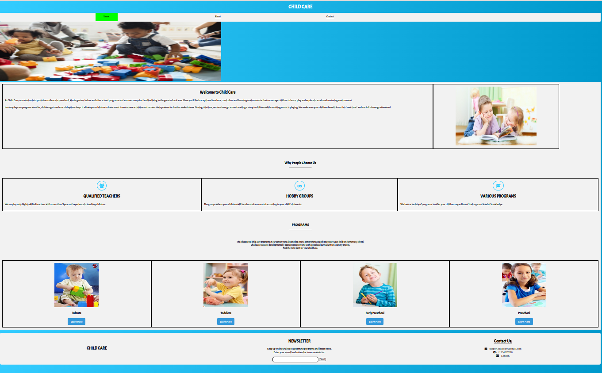
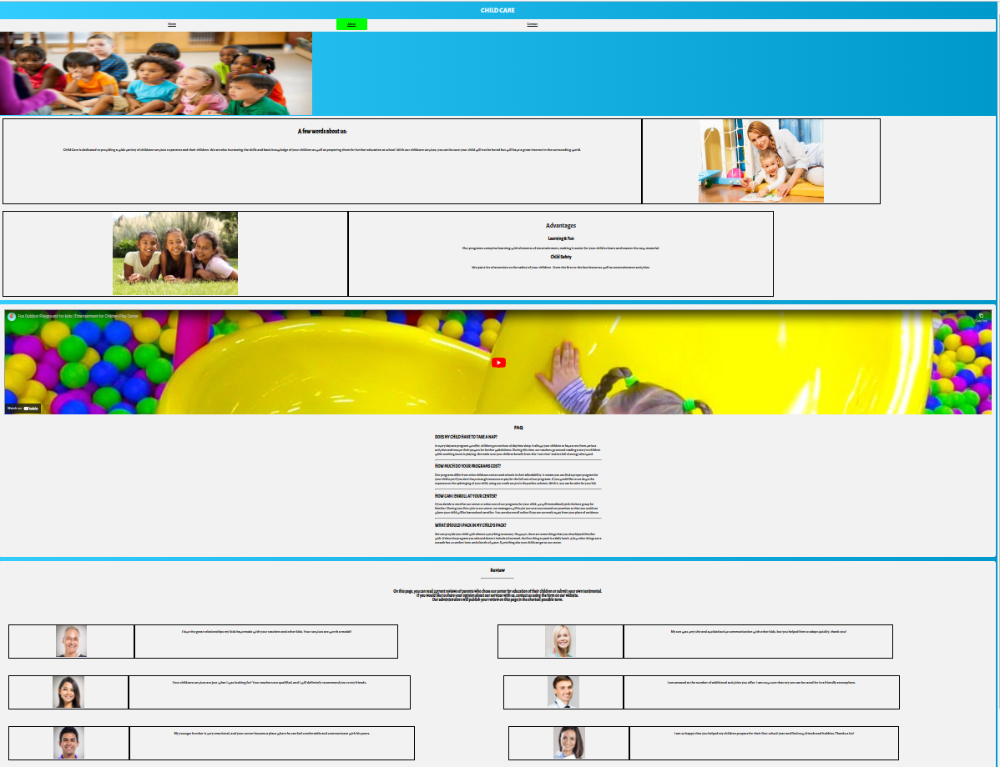
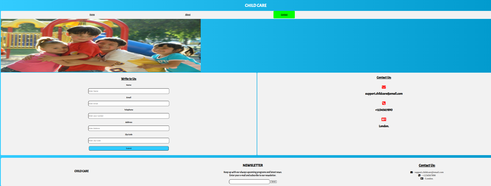

# Child Care

Child Care is a website to provide excellence in preschool, kindergarten, before and after school programs and summer camp for families living in the greater local area.

#### Purpose of Website

Child Care is dedicated to providing a wide variety of childcare services to parents and their children. It also helps in increasing the skills and basic knowledge of the children as well as preparing them for further education at school.

The website is built only using HTML and CSS only.

#### Features

##### Navigation Bar

- The three page navigation bar consist of Home, About and Contact pages responsive to all screen sizes.
- This navigation bar is consistent in all pages hence the user can move to all the pages to their wish.

##### Home Page

The home page has different sections as follows :

- Why People Choose us section - This section describes the user about the services they provide which makes them unique.
- Programs section - This section list all the programs provided to the users. The program are made seperately for Toddlers, Infants, Early Preschool and Preschool kids.

##### About Page

The about page has different sections as follow

- Advantages Section - Here the users are explained what are the advantages of joining in the program.
- FAQ Section - Some of the frequently asked questions are listed here for the users to clear their doubts.
- Review Section - This section displays the reviews of the existing users.

##### Contact Page

- This page has only two sections - one section has a form for the user to reach out and the other section has some communication details for the users.

#### Screenshots

##### Home Page

##### About Page

##### Contact Page

#### Testing

- The testing for this webpages are done in individual commits by uploading one page at a time.
- Initially the Home page was uploaded and checked if it works properly only in large screens. Responsive design is implemented only in the final commit.
- Once the Home page works well, the About page is checked if it works well without any errors.
- Finally the Contact page is uploaded and checked if it works well and as planned.
- Since all the webpages works good in the small screen, the pages are made responsive to all screen sizes with the use of media queries.
- Now the responsiveness of the webpage in multiple scren sizes are tested and found error free.

##### Validator Testing

- HTML Testing : No errors were returned when passing through the official [W3C Validator](https://validator.w3.org/nu/)
- CSS : No errors were found when passing through the official [Jigsaw Validator](https://jigsaw.w3.org/css-validator/)

#### Deployment

The live link can be found here - [https://yasminhirsi.github.io/Portfolio_Project_1](https://yasminhirsi.github.io/Portfolio_Project_1/)

#### Credits

##### Content

- The font used in the Webpages are from Google Fonts - [Google Fonts](https://fonts.google.com/specimen/Acme?query=acme)
- The icons used in the webpages are from [Font Awesome](https://fontawesome.com/)

##### Media

- The images used in the website is taken from https://google.com/
- The video used in the website is taken from [Youtube](https://www.youtube.com/embed/6-yc-IHhTOE)
